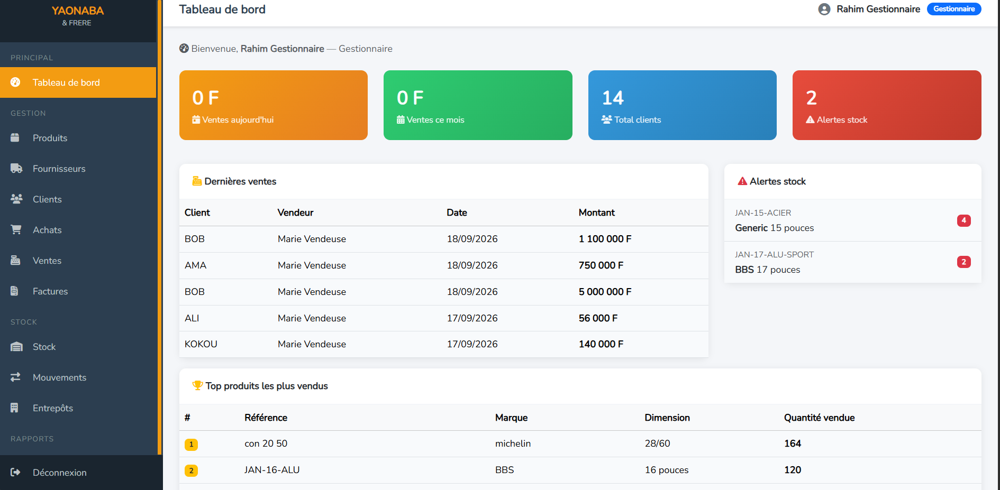
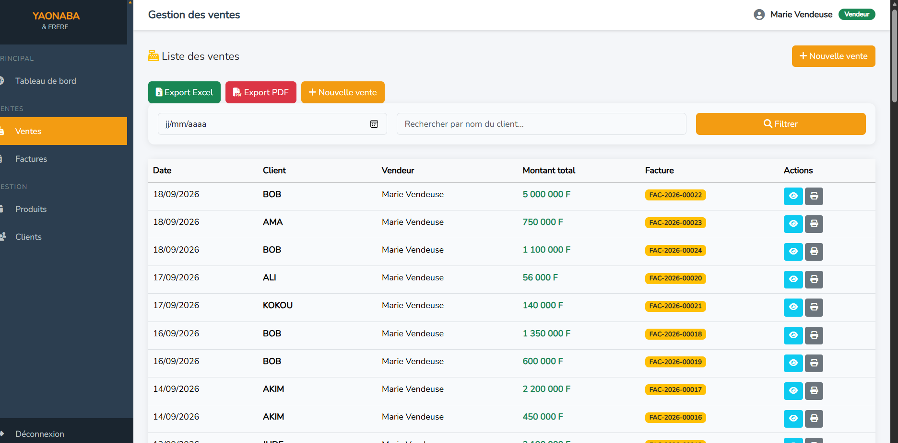

# Gestion commerciale (Laravel)

Application web de gestion commerciale pour une entreprise de vente de pneus et jantes à Lomé (Togo), réalisée dans le cadre de mon projet de fin de cycle en Licence d'Informatique (ESGIS).

## Fonctionnalités

- Gestion des ventes, des achats et des factures
- Gestion du stock par entrepôt, avec mouvements de stock et alertes
- Gestion des clients et des fournisseurs
- Système de fidélité client (Normal / Fidèle / VIP) avec remises automatiques
- Quatre rôles (administrateur, gestionnaire, vendeur, magasinier), chacun avec son tableau de bord
- Statistiques et exports (PDF, Excel)

## Technologies

Laravel 12, PHP 8.2, MySQL, Bootstrap 5, JavaScript, Blade, XAMPP

## Captures d'écran

## Installation

1. Cloner le dépôt : `git clone https://github.com/AGBENDAmartine/gestion-commerciale-laravel.git`
2. Installer les dépendances : `composer install` puis `npm install`
3. Copier `.env.example` en `.env`, puis configurer la base MySQL
4. Générer la clé : `php artisan key:generate`
5. Créer les tables : `php artisan migrate`
6. Compiler les ressources : `npm run build`
7. Lancer l'application : `php artisan serve`

## Auteure

Martine Agbenda, développeuse full stack, Lomé (Togo)
